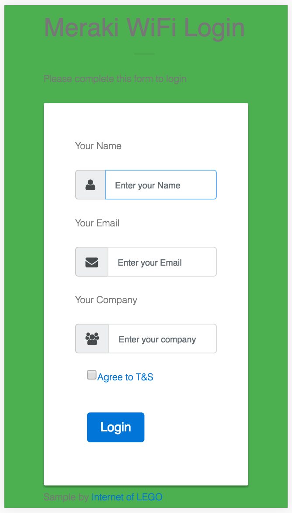

### excap-MerakiSplashSimple-client-side

# Cisco Meraki Captive Portal 


## Overview
### Click-through splash page using public HTML/CSS/JS to perform all login actions. 
This sample code demonstrates how a simple web page with no server-side logic can be used to build a functional Meraki Captive Portal login.

A NodeJS server is provided with this example to simply host the public web files. If you prefer to use your own web server, such as Apache, simply copy the contents of the public folder into your web directory.

An action for handling the form will need to be adjusted to commit to a database or post to an API of your choice. This example will post to a `/form` URL, which this NodeJS server will simply print the contents to the console to demonstrate the variable passing.

## Instructions 

### Installation and local test
* Clone repository
* Change into the directory
* `npm install`
* `node server.js`
* Navigate to website to confirm its running
** http://localhost:5000/

### Testing / Deployment
* Host this file on a webserver. 
  * Apache: Just copy the public folder to your www directory
  * NodeJS: Perform the above steps on a server with NodeJS installed. For example Heroku or an Ubuntu we server.
* Configure the Meraki wireless SSID with a Click-Through splash page authentication
    * Dashboard --> Configure --> Splash Page: Click-through
* Point the Meraki Splash page "Customer URL" to the HTML file. (https://yourserver/splash.html or splash-with-style.html)
    * Dashboard --> Configure --> Splash Page --> Custom URL: `https://yourserver.com/splash.html`
* Add the domain address of the webserver to the "Walled Garden" 
    * Dashboard --> Configure --> Access Control --> SSID:yourSSID --> *Walled Garden*.
    * Note: You will need to use the IP address instead of the domain name or contact Meraki Support to enable Walled Garden Host Names
    * Any external resources, such as Javascript or CSS libraries like Bootstrap, or websites should be added into the walled garden for your site to work properly. 


## How does it work?
A Meraki Click-through splash page works be intercepting a client when it attempts to open a non-encrypted website (HTTP). The AP will then redirect the client to the splash page URL, along with a set of paramaters.

*Sample URL paramater string*
```
http://yourserver:5000/splash.html?base_grant_url=https%3A%2F%2Fn143.network-auth.com%2Fsplash%2Fgrant&user_continue_url=http%3A%2F%2Fask.com%2F&node_id=149624921787028&node_mac=88:15:44:50:0a:94&gateway_id=149624921787028&client_ip=10.110.154.195&client_mac=60:e3:ac:f7:48:08:22
```

The most important parameter is the `base_grant_url` which contains a specific URL the client must be directed to, which grants access to the network. This is not meant to be a high security interaction. Instead it is used as an intermediate step to collect some data, present a terms of service and present any branding required.

## Screenshot


## Advanced Version
For a more secure method that supports both click-through and sign-on splash pages, check out this article along with source code. A NodeJS server will process all of the login and provide more flexibility with managing the session data in a secure and scalable way.
http://www.internetoflego.com/wifi-hotspot-cisco-meraki-excap-nodejs/

## Additional Resources
http://developers.meraki.com/tagged/Splash-Pages

### Written by 
Cory Guynn
2016
www.InternetOfLEGO.com


## LICENSE
The MIT License (MIT)
Copyright (c) 2016, Cory Guynn

Permission is hereby granted, free of charge, to any person obtaining a copy of this software and associated documentation files (the "Software"), to deal in the Software without restriction, including without limitation the rights to use, copy, modify, merge, publish, distribute, sublicense, and/or sell copies of the Software, and to permit persons to whom the Software is furnished to do so, subject to the following conditions:

The above copyright notice and this permission notice shall be included in all copies or substantial portions of the Software.

THE SOFTWARE IS PROVIDED "AS IS", WITHOUT WARRANTY OF ANY KIND, EXPRESS OR IMPLIED, INCLUDING BUT NOT LIMITED TO THE WARRANTIES OF MERCHANTABILITY, FITNESS FOR A PARTICULAR PURPOSE AND NONINFRINGEMENT. IN NO EVENT SHALL THE AUTHORS OR COPYRIGHT HOLDERS BE LIABLE FOR ANY CLAIM, DAMAGES OR OTHER LIABILITY, WHETHER IN AN ACTION OF CONTRACT, TORT OR OTHERWISE, ARISING FROM, OUT OF OR IN CONNECTION WITH THE SOFTWARE OR THE USE OR OTHER DEALINGS IN THE SOFTWARE.


